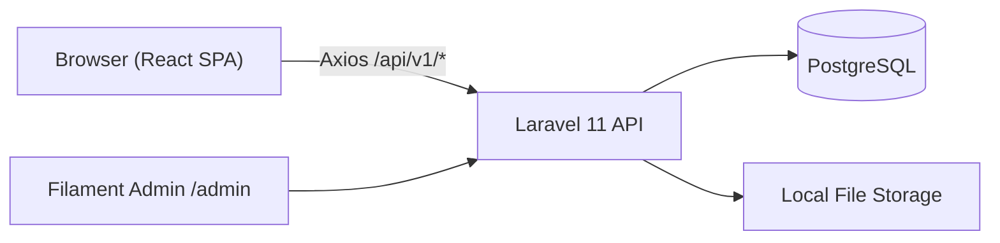
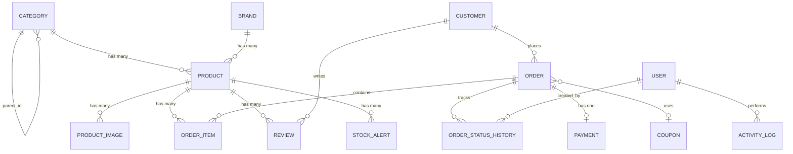

# 📑 Product Requirements Document (PRD)

# E-Commerce Admin Dashboard

**Project:** E-Commerce Admin Dashboard  
**Version:** 4.1 (Production-Grade — Post-Implementation Update)  
**Status:** MVP Complete → Production Hardening  
**Author:** Mortada  
**Last Updated:** 2026-04-01  
**Repository:** [github.com/mortada335/e-commerce-admin-dashboard](https://github.com/mortada335/e-commerce-admin-dashboard)

---

## Table of Contents

1. [Project Overview](#1-project-overview)
2. [Who Uses This](#2-who-uses-this)
3. [What It Does — Feature by Feature](#3-what-it-does--feature-by-feature)
4. [System Architecture](#4-system-architecture)
5. [Database Schema](#5-database-schema)
6. [API Reference](#6-api-reference)
   - 6.1 [API Standardization](#61-api-standardization-new) `[NEW]`
   - 6.2 [Security Hardening](#62-security-hardening-new) `[NEW]`
   - 6.3 [Edge Cases & Failure Scenarios](#63-edge-cases--failure-scenarios-new) `[NEW]`
7. [Frontend Structure](#7-frontend-structure)
8. [Authentication Flow](#8-authentication-flow)
9. [UI Design System](#9-ui-design-system)
10. [Seed Data](#10-seed-data)
11. [Tech Stack & Dependencies](#11-tech-stack--dependencies)
12. [How to Run](#12-how-to-run)
13. [Deployment](#13-deployment)
14. [Known Limitations](#14-known-limitations) `[UPDATED]`
15. [KPI & Data Definitions](#15-kpi--data-definitions-new) `[NEW]`
16. [Concurrency & Data Integrity](#16-concurrency--data-integrity-new) `[NEW]`
17. [Testing Strategy](#17-testing-strategy-new) `[NEW]`
18. [Observability & Monitoring](#18-observability--monitoring-new) `[NEW]`
19. [Background Jobs & Queues](#19-background-jobs--queues-new) `[NEW]`
20. [Notifications System](#20-notifications-system-new--expanded) `[NEW]`
21. [Scalability & Performance](#21-scalability--performance-new) `[NEW]`
22. [Integration Readiness](#22-integration-readiness-new) `[NEW]`
23. [UX & Accessibility](#23-ux--accessibility-new) `[NEW]`
24. [Future Roadmap](#24-future-roadmap-updated) `[UPDATED]`

---

## 1. Project Overview

This is a **full-stack admin dashboard** for managing an e-commerce store. It has two admin interfaces:

1. **React SPA** (port 5173) — A custom-built management dashboard with Glassmorphism design, charts, and analytics. This is the primary interface.
2. **Filament Admin** (port 8000/admin) — A Laravel-native back-office panel generated with Filament v5 for quick data operations.

Both interfaces share the same database and the same Eloquent models. The React SPA communicates with the backend via a RESTful JSON API at `/api/v1/`.

### What this project is NOT
- It is NOT a customer-facing storefront. There is no shopping cart, no checkout, no public product catalog.
- It is NOT multi-tenant. It manages a single store.
- It does NOT have real-time features (no WebSockets). All data is fetched via polling/manual refresh.

---

## 2. Who Uses This

This dashboard is designed for three types of admin users. All three roles exist in the database seeder.

### Admin (`admin@example.com` / `password`)
- Has ALL permissions.
- Can access every page, create/delete any record, manage settings.
- The `hasPermission()` function in the auth store returns `true` for all checks if the user has the `admin` role.

### Manager (`manager@example.com` / `password`)
- Can view dashboard, products, orders, customers, categories, inventory, payments.
- Can manage (create/edit/delete) products and orders.
- Cannot manage settings, coupons, reviews, or banners.

### Staff (`staff@example.com` / `password`)
- Read-only access to dashboard, products, orders, customers, categories, brands, inventory.
- Cannot create, edit, or delete anything.

**Roles are managed by** [Spatie Laravel Permission](https://spatie.be/docs/laravel-permission). The seeder creates 20 permissions:

```
view dashboard, view products, manage products, view orders, manage orders,
view customers, manage customers, view categories, manage categories,
view brands, manage brands, view coupons, manage coupons,
view inventory, manage inventory, view settings, manage settings,
view payments, manage banners, manage reviews
```

---

## 3. What It Does — Feature by Feature

### 3.1 Dashboard Page (`/`)

The dashboard makes **7 API calls** on mount to populate a data-rich overview:

| Widget | API Call | What it Shows |
|:---|:---|:---|
| **4 KPI Cards** | `GET /dashboard/stats` | Total Revenue (with month-over-month growth %), Total Orders (with pending count), Total Customers (with new this month), Low Stock count |
| **Revenue Chart** | `GET /dashboard/sales-chart?days=30` | Recharts `AreaChart` showing daily revenue over the last 30 days. Supports custom date range via `from`/`to` params |
| **Top Products** | `GET /dashboard/top-products?limit=5` | Horizontal `BarChart` showing the 5 best-selling products by quantity (joins `order_items` → `products`) |
| **Recent Orders** | `GET /dashboard/recent-orders?limit=8` | Table showing the 8 most recent orders with status badges. Rows are clickable → navigates to `/orders/{id}` |
| **Order Status Summary** | `GET /dashboard/order-status-summary` | Progress bars showing distribution of order statuses (pending: 25%, processing: 25%, etc.) |
| **Revenue by Category** | `GET /dashboard/revenue-by-category` | Bar breakdown of revenue per product category (joins `order_items` → `products` → `categories`) |
| **Low Stock Alerts** | `GET /inventory/alerts` | Only appears if there are products below threshold. Shows product name, SKU, category, current stock, and threshold |

The dashboard has a **date range picker** (two `<input type="date">` fields) that filters the KPI stats and sales chart to a custom period. When dates are set, the `DashboardService` computes stats for that range and compares against the equivalent previous period for growth calculations.

### 3.2 Products (`/products`)

**What the user sees:**
- A searchable, filterable table of all products.
- Filters: text search (name/SKU), category dropdown, status dropdown (draft/active/inactive).
- Each row shows: product name, SKU, category, price, stock quantity, status badge, featured flag.
- Actions per row: View details, Edit (opens `ProductForm`), Delete (with confirmation).
- "Add Product" button opens the `ProductForm` component.

**ProductForm (`ProductForm.tsx`):**
- Fields: Name, SKU, Price, Compare-at Price, Description, Stock Quantity, Low Stock Threshold, Status (dropdown), Is Featured (toggle), Category (dropdown), Brand (dropdown).
- Image upload: Supports multiple files. Images are sent as `multipart/form-data`.
- On create: `POST /products` with `FormData`.
- On edit: `POST /products/{id}` with `FormData` and `_method=PUT` param (Laravel convention for file uploads with PUT).

**Backend logic (`ProductService.php`):**
- Products are created inside a `DB::transaction`.
- SKU uniqueness is enforced at the database level. If violated, a `ValidationException` is thrown with a user-friendly message.
- Images are stored under `storage/app/public/products/{product_id}/` using Laravel's filesystem.
- The first uploaded image (when no existing images) is automatically marked as `is_primary = true`.
- When deleting a product that has been referenced in orders → the product is soft-deleted (images kept for order history). When deleting a product with no order references → images are deleted from disk, then the product is deleted.
- Every create, update, and delete triggers an `ActivityLog::record()` call.

### 3.3 Categories (`/categories`)

- Full CRUD table.
- Supports **parent/child hierarchy**: a category can have a `parent_id` pointing to another category.
- The API has a special `GET /categories/tree` endpoint that returns the full nested tree structure.
- Each category has: name, slug (unique), description, image, `is_active` flag, `sort_order`.

### 3.4 Orders (`/orders`)

**What the user sees:**
- Table with filters: text search (order number or customer name/email), status dropdown, payment status dropdown.
- Each row: order number (e.g., `ORD-...`), customer name, status badge, payment badge, total, date.
- Eye icon → opens a **detail modal** showing:
  - Customer info: name, email, phone.
  - Shipping address (stored as JSON).
  - Line items: product name, quantity × unit price, line total.
  - Summary: subtotal, discount total, tax total, grand total.

**Order Status Lifecycle (`OrderService.php`):**
The service implements a **state machine** with explicit transition guards:

```
pending    → processing, canceled
processing → shipped, canceled
shipped    → delivered
delivered  → refunded
canceled   → (terminal — no further transitions)
refunded   → (terminal — no further transitions)
```

- If you try to transition to the same status → `ValidationException: "Order is already 'pending'."`.
- If you try an invalid transition (e.g., pending → delivered) → `ValidationException: "Cannot transition from 'pending' to 'delivered'. Allowed: processing, canceled."`.
- On transition to `shipped`: `shipped_at` timestamp is auto-set.
- On transition to `delivered`: `delivered_at` timestamp is auto-set.
- Every transition creates an `OrderStatusHistory` record (with the user who made the change and an optional comment).
- Every transition logs to `ActivityLog`.

**Search logic:** Uses PostgreSQL `ILIKE` for case-insensitive search. Searches across `order_number` and also reaches into the related `customer` table to match `email` or `CONCAT(first_name, ' ', last_name)`.

### 3.5 Customers (`/customers`)

- Full CRUD table with search (ILIKE across name and email).
- Eye icon → opens a **detail modal** showing:
  - Avatar with first-name initial, full name, member-since date.
  - Email, phone.
  - Default shipping address (stored as JSON with `address`, `city`, `state`, `zip_code`, `country`).
  - Total Orders count, Total Spent (aggregate fields).
- `GET /customers/{id}/orders` returns paginated orders for a specific customer.

### 3.6 Inventory (`/inventory`)

- A dedicated page for **rapid stock editing** — separate from the Products page.
- Table columns: Product name, SKU, Category, Current Stock (editable `<input type="number">`), Low Threshold (editable), Save button.
- The save button is **disabled by default** and **only activates when values differ from the original** (dirty state detection in `InventoryRow` component using React `useState`).
- Low-stock rows are highlighted with `bg-destructive/5` background and a pulsing `AlertTriangle` icon.
- Toggle checkbox: "Show only low stock" filters the list client-side.
- Stats cards at top: Total Items count, Low Stock Alerts count.
- API: `PATCH /inventory/{productId}/stock` with `{ stock_quantity, low_stock_threshold }`.

### 3.7 Coupons (`/coupons`)

- Full CRUD table.
- Coupon fields: Code (unique, uppercase), Type (`fixed` or `percentage`), Value, Minimum Purchase Amount, Usage Limit, Used Count (auto-incremented), Description, Starts At, Expires At, Is Active.
- Validation endpoint: `POST /coupons/validate` checks if a coupon code is valid (exists, active, not expired, usage limit not reached).

### 3.8 Brands (`/brands`)

- Full CRUD table with logo image upload (`multipart/form-data`).
- Brand fields: Name, Slug (unique), Logo (file), Description, Is Active.
- Products reference brands via `brand_id` foreign key.

### 3.9 Reviews (`/reviews`)

- Full CRUD table.
- Review fields: Product (dropdown), Customer (dropdown), Rating (1-5), Comment (text), Is Approved (boolean).
- Special action: `POST /reviews/{id}/toggle-approval` flips the `is_approved` flag and sets/clears `approved_at`.
- Stats endpoint: `GET /reviews/stats` returns counts of total, approved, pending.

### 3.10 Banners (`/banners`)

- Full CRUD table with image upload.
- Banner fields: Title, Image (file), Link URL, Target (`_self` or `_blank`), Sort Order, Is Active.
- Used for managing promotional hero sliders on the (future) customer-facing storefront.

### 3.11 Settings (`/settings`)

- A form page (not a table) that reads and writes global store configuration.
- Currently 7 seeded settings:

| Key | Default Value | Group |
|:---|:---|:---|
| `store_name` | My E-Commerce Store | store |
| `store_email` | hello@store.com | store |
| `currency` | USD | currency |
| `currency_symbol` | $ | currency |
| `tax_rate` | 8 | tax |
| `free_shipping_threshold` | 100 | shipping |
| `flat_shipping_rate` | 9.99 | shipping |

- Read: `GET /settings` returns all settings as an array.
- Write: `PUT /settings` with `{ settings: { key: value, ... } }` updates multiple keys in one request.

### 3.12 Activity Log (`/activity-log`)

- Read-only paginated table of all admin actions.
- Each entry shows: Action type, affected model, who did it, when, old values (JSON), new values (JSON).
- Searchable by action type, date range.
- Actions are recorded automatically by Services when products/orders/customers are created, updated, or deleted.

### 3.13 Notifications

- Bell icon in the Topbar with unread count badge.
- `GET /notifications` returns the authenticated user's unread Laravel notifications.
- `POST /notifications/{id}/read` marks a single notification as read.
- `POST /notifications/read-all` marks all as read.

---

## 4. System Architecture

### 4.1 High-Level Flow



### 4.2 Backend Layers

```
HTTP Request
    ↓
Route (routes/api.php)           → Matches URL to Controller method
    ↓
Middleware (auth:sanctum)        → Validates session/token
    ↓
FormRequest                      → Validates input data
    ↓
Controller                       → Thin — delegates to Service
    ↓
Service (ProductService, etc.)   → Business logic, transactions, file handling
    ↓
Eloquent Model                   → Database queries, relationships
    ↓
API Resource                     → JSON serialization (what the client sees)
```

**4 Service classes exist:**
- `DashboardService` (211 lines) — All 7 dashboard aggregation methods.
- `ProductService` (128 lines) — CRUD, image upload/delete, soft-delete logic.
- `OrderService` (117 lines) — Status transitions with state machine, search with ILIKE + customer join.
- `CustomerService` — CRUD, search, activity logging.

**13 API Controllers:**
`AuthController`, `DashboardController`, `ProductController`, `CategoryController`, `OrderController`, `CustomerController`, `CouponController`, `InventoryController`, `BrandController`, `ReviewController`, `BannerController`, `SettingController`, `ActivityLogController`.

### 4.3 Frontend Layers

```
Browser
    ↓
React Router v7                  → URL → Page component
    ↓
AppLayout                        → Auth guard (redirect to /login if not authenticated)
    ↓
Feature Page (e.g. ProductsPage) → UI rendering, event handlers
    ↓
TanStack Query (useQuery/useMutation) → Caching, refetching, loading states
    ↓
API Module (lib/api/index.ts)    → Typed Axios wrappers per domain
    ↓
Axios Instance (lib/api/axios.ts)→ Bearer token injection, 401 auto-logout
    ↓
Laravel API
```

**Axios Interceptors (actual code):**
- **Request interceptor:** Reads `token` from `useAuthStore.getState()` and sets `Authorization: Bearer {token}` header.
- **Response interceptor:** On 401 response → calls `useAuthStore.getState().logout()` (clears localStorage) → redirects to `/login`.

---

## 5. Database Schema

### 5.1 Entity Relationships



### 5.2 All Tables (19 Eloquent Models)

| Model | Table | Key Fields | Notable |
|:---|:---|:---|:---|
| `User` | `users` | name, email, password, is_active | Spatie roles/permissions |
| `Category` | `categories` | name, slug⁺, parent_id, image, is_active, sort_order | Self-referencing FK for hierarchy |
| `Brand` | `brands` | name, slug⁺, logo, description, is_active | — |
| `Product` | `products` | name, slug⁺, sku⁺, price, compare_at_price, cost_price, stock_quantity, low_stock_threshold, status, is_featured, category_id, brand_id, deleted_at | Soft deletes (⁺ = unique) |
| `ProductImage` | `product_images` | product_id, path, sort_order, is_primary | — |
| `ProductVariant` | `product_variants` | product_id, sku, price, stock | Future use — model exists, no UI yet |
| `Attribute` | `attributes` | name, type | Future use for product attributes |
| `AttributeValue` | `attribute_values` | attribute_id, value | Future use |
| `Customer` | `customers` | first_name, last_name, email⁺, phone, address (JSON), is_active, total_spent, orders_count | Address is a JSON column |
| `Order` | `orders` | order_number⁺, customer_id, coupon_id, subtotal, tax_total/tax_amount, discount_total, total, status, payment_status, shipping_address (JSON), shipped_at, delivered_at | Auto-generates order_number |
| `OrderItem` | `order_items` | order_id, product_id, product_name, product_sku, unit_price, quantity, subtotal | Denormalized product name/sku for history |
| `OrderStatusHistory` | `order_status_histories` | order_id, status, comment, created_by | Audit trail for order transitions |
| `Payment` | `payments` | order_id, method, transaction_id, amount, status, currency, paid_at, metadata (JSON) | One payment per order |
| `Coupon` | `coupons` | code⁺, type, value, min_order_amount, usage_limit, used_count, is_active, expires_at | Type: `fixed` or `percentage` |
| `Review` | `reviews` | product_id, customer_id, rating (1-5), comment, is_approved, approved_at | Approval gate |
| `Banner` | `banners` | title, image, link_url, target, sort_order, is_active | — |
| `Setting` | `settings` | key⁺, value, group, type, label | Key-value store |
| `StockAlert` | `stock_alerts` | product_id, threshold, resolved | — |
| `ActivityLog` | `activity_logs` | action, model_type, model_id, old_values (JSON), new_values (JSON), user_id | Full mutation audit |

**29 migration files** total (including 6 schema alignment migrations from the development process).

---

## 6. API Reference

All endpoints are under `/api/v1/`. All except `POST /auth/login` require `auth:sanctum` middleware.

### Authentication
| Method | Endpoint | Body/Params | Response |
|:---|:---|:---|:---|
| `POST` | `/auth/login` | `{ email, password }` | `{ user, token }` |
| `GET` | `/auth/me` | — | Current user + roles |
| `POST` | `/auth/logout` | — | `{ message }` |

### Dashboard (7 endpoints)
| Method | Endpoint | Params | Returns |
|:---|:---|:---|:---|
| `GET` | `/dashboard/stats` | `from?`, `to?` | Revenue, orders, customers, low_stock_count with period comparison |
| `GET` | `/dashboard/sales-chart` | `days?`, `from?`, `to?` | `[{ date, revenue, orders }]` |
| `GET` | `/dashboard/recent-orders` | `limit?` | Latest N orders with customer |
| `GET` | `/dashboard/top-products` | `limit?` | `[{ id, name, sku, total_sold, total_revenue }]` |
| `GET` | `/dashboard/order-status-summary` | — | `{ by_status, by_payment_status, total }` |
| `GET` | `/dashboard/new-customers` | `days?` | `{ total_new, daily: [{ date, count }] }` |
| `GET` | `/dashboard/revenue-by-category` | — | `[{ category_id, category_name, revenue, orders_count }]` |

### Products (11 endpoints)
| Method | Endpoint | Notes |
|:---|:---|:---|
| `GET` | `/products` | Params: `search`, `category_id`, `status`, `low_stock`, `sort_by`, `sort_dir`, `page`, `per_page` |
| `GET` | `/products/stats` | Aggregate stats |
| `GET` | `/products/export` | CSV export (returns blob) |
| `POST` | `/products` | `multipart/form-data` — includes `images[]` file array |
| `GET` | `/products/{id}` | Includes category, images, variants |
| `PUT` | `/products/{id}` | Via `POST` with `_method=PUT` for FormData compatibility |
| `DELETE` | `/products/{id}` | Soft-deletes if in orders, hard-deletes otherwise |
| `POST` | `/products/{id}/images` | Upload additional images |
| `DELETE` | `/products/{id}/images/{imageId}` | Remove specific image from disk + DB |
| `POST` | `/products/bulk-status` | `{ ids: [], status }` |
| `POST` | `/products/bulk-delete` | `{ ids: [] }` |

### Orders (7 endpoints)
| Method | Endpoint | Notes |
|:---|:---|:---|
| `GET` | `/orders` | Params: `search`, `status`, `payment_status`, `date_from`, `date_to`, `page` |
| `GET` | `/orders/stats` | Aggregate stats |
| `GET` | `/orders/export` | CSV export |
| `GET` | `/orders/{id}` | Includes customer, items, payment, statusHistory |
| `PUT` | `/orders/{id}` | Update order details |
| `POST` | `/orders/{id}/status` | `{ status, comment? }` — guarded state machine |
| `POST` | `/orders/bulk-status` | `{ ids: [], status }` |

### Customers (7 endpoints)
| Method | Endpoint | Notes |
|:---|:---|:---|
| `GET` | `/customers` | Params: `search`, `is_active`, `page` |
| `GET` | `/customers/stats` | Aggregate stats |
| `GET` | `/customers/export` | CSV export |
| `POST` | `/customers` | Create a customer |
| `GET` | `/customers/{id}` | Customer profile |
| `PUT` | `/customers/{id}` | Update |
| `DELETE` | `/customers/{id}` | Delete |
| `GET` | `/customers/{id}/orders` | Paginated order history for that customer |

### Inventory (7 endpoints)
| Method | Endpoint | Notes |
|:---|:---|:---|
| `GET` | `/inventory` | Paginated product stock listing |
| `GET` | `/inventory/stats` | Stock statistics |
| `GET` | `/inventory/alerts` | Only products where stock ≤ threshold |
| `GET` | `/inventory/history` | Stock change history |
| `GET` | `/inventory/export` | CSV export |
| `PATCH` | `/inventory/{productId}/stock` | `{ stock_quantity, low_stock_threshold? }` |
| `POST` | `/inventory/bulk-update` | Batch stock update |

### Coupons (6 endpoints)
Standard CRUD + `GET /coupons/stats` + `POST /coupons/validate`.

### Brands (6 endpoints)
Standard CRUD (with `multipart/form-data` for logo) + `GET /brands/export`.

### Reviews (6 endpoints)
Standard CRUD + `GET /reviews/stats` + `POST /reviews/{id}/toggle-approval`.

### Banners (5 endpoints)
Standard CRUD with `multipart/form-data` for image.

### Settings (2 endpoints)
`GET /settings` and `PUT /settings`.

### Activity Logs (1 endpoint)
`GET /activity-logs` with params: `search`, `action`, `date_from`, `date_to`, `page`.

### Notifications (3 endpoints)
`GET /notifications`, `POST /notifications/{id}/read`, `POST /notifications/read-all`.

**Total: 60+ endpoints across 13 controllers.**

### 6.1 API Standardization `[NEW]`

#### Global Response Format

All API responses MUST follow this envelope:

```json
// Success
{ "success": true, "data": { ... }, "meta": { "current_page": 1, "last_page": 5, "per_page": 15, "total": 72 } }

// Error
{ "success": false, "error": { "code": "VALIDATION_ERROR", "message": "Human-readable summary", "details": { "sku": ["A product with this SKU already exists."] } } }
```

#### Error Codes

| Code | HTTP Status | When |
|:---|:---|:---|
| `VALIDATION_ERROR` | 422 | FormRequest validation fails |
| `UNAUTHORIZED` | 401 | Missing or invalid Sanctum token |
| `FORBIDDEN` | 403 | Valid token but insufficient permissions |
| `NOT_FOUND` | 404 | Resource does not exist |
| `STATE_CONFLICT` | 409 | Invalid order transition, duplicate SKU |
| `RATE_LIMITED` | 429 | Too many requests |
| `SERVER_ERROR` | 500 | Unhandled exception |

#### Pagination

All paginated endpoints return Laravel's `LengthAwarePaginator` format inside `meta`:
```json
{ "current_page": 1, "last_page": 5, "per_page": 15, "total": 72, "from": 1, "to": 15 }
```
Default `per_page`: 15. Maximum `per_page`: 100 (enforced server-side).

#### Versioning Strategy

- Current version: `/api/v1/`
- Breaking changes MUST introduce `/api/v2/` with a deprecation period on v1 (minimum 6 months)
- Non-breaking additions (new fields, new endpoints) are added to the current version
- Version is defined in the URL path, not headers

---

### 6.2 Security Hardening `[NEW]`

#### Backend Authorization Enforcement

Every API endpoint MUST enforce permissions via middleware, not just frontend UI hiding.

| Endpoint Group | Required Permission | Middleware |
|:---|:---|:---|
| `GET /dashboard/*` | `view dashboard` | `permission:view dashboard` |
| `GET /products` | `view products` | `permission:view products` |
| `POST/PUT/DELETE /products` | `manage products` | `permission:manage products` |
| `GET /orders` | `view orders` | `permission:view orders` |
| `POST /orders/{id}/status` | `manage orders` | `permission:manage orders` |
| `GET /customers` | `view customers` | `permission:view customers` |
| `POST/PUT/DELETE /customers` | `manage customers` | `permission:manage customers` |
| `PUT /settings` | `admin` role only | `role:admin` |

**Implementation:** ✅ Implemented in `routes/api.php` using Spatie's `permission:` and `role:` middleware on all route groups.

#### Rate Limiting

| Context | Limit | Window | Key |
|:---|:---|:---|:---|
| `POST /auth/login` | 5 attempts | 1 minute | IP address |
| `POST /auth/login` (failed) | 10 attempts | 15 minutes | IP + email combo |
| Authenticated API (global) | 120 requests | 1 minute | User ID |
| CSV export endpoints | 5 requests | 5 minutes | User ID |
| Bulk operations | 10 requests | 1 minute | User ID |

**Implementation:** ✅ Implemented via Laravel `RateLimiter` in `AppServiceProvider::boot()` with named limiters `login`, `api`, and `export`.

#### Input Sanitization

- All text inputs are validated via FormRequest classes (already exists for Products, Customers, Coupons)
- **XSS Prevention:** All text outputs are escaped by default via Laravel's Blade/JSON encoding. React also auto-escapes JSX output. Description fields that accept rich text MUST use `strip_tags()` or an allowlist-based HTML sanitizer.
- **SQL Injection:** Mitigated by Eloquent ORM parameterized queries. Raw `DB::raw()` and `whereRaw()` calls (used in search) MUST use parameter binding (currently correct with `?` placeholders).
- **File Upload:** Restricted to `jpeg,png,webp` with 5MB max per file, 10 files max per request (enforced in `StoreProductRequest`).

#### Sensitive Data Handling

- Passwords: Hashed with `bcrypt` (Laravel default). Never returned in API responses.
- Sanctum tokens: Stored as SHA-256 hashes in `personal_access_tokens` table. Plain-text token shown only once at creation.
- Customer addresses: Stored as JSON. In production, encrypt the column using Laravel's `$casts = ['address' => 'encrypted:array']`.
- Payment `transaction_id`: Mask in API responses, show only last 4 characters. Full value accessible only in Filament admin.
- Activity log `old_values`/`new_values`: Automatically strip `password` fields before recording.

#### CORS, Cookie & Token Security

```php
// config/cors.php (production)
'allowed_origins' => [env('FRONTEND_URL')],       // No wildcards
'allowed_methods' => ['GET', 'POST', 'PUT', 'PATCH', 'DELETE'],
'allowed_headers' => ['Content-Type', 'Authorization', 'X-Requested-With'],
'supports_credentials' => true,

// Sanctum token config
'expiration' => 480,        // Tokens expire after 8 hours
'token_prefix' => '',
```

- ✅ Sanctum tokens now expire after 8 hours (`config/sanctum.php`: `expiration => 480`)
- ✅ CORS locked down via `config/cors.php` to `env('FRONTEND_URL')` only
- Frontend must handle 401 responses and re-authenticate (already implemented in Axios interceptor)

#### Audit Log Integrity

- Activity logs are **append-only**: no `UPDATE` or `DELETE` operations permitted on the `activity_logs` table.
- Controller: `ActivityLogController` exposes only `GET /activity-logs` (read-only) — confirmed in routes.
- Future: Add database-level trigger or policy to prevent `DELETE` on `activity_logs` table.
- Future: Add a `checksum` column (SHA-256 of `action + model_type + model_id + old_values + new_values + user_id + created_at`) for tamper detection.

---

### 6.3 Edge Cases & Failure Scenarios `[NEW]`

#### Order Status Transitions

| Scenario | System Behavior |
|:---|:---|
| `pending → delivered` (skipping steps) | `ValidationException`: "Cannot transition from 'pending' to 'delivered'. Allowed: processing, canceled." |
| Same status applied twice | `ValidationException`: "Order is already 'pending'." |
| Bulk status update with mixed-validity orders | Each order validated independently via `canTransition()`. Invalid ones are skipped and reported in the response. |
| Status change on a `canceled` or `refunded` order | Rejected — these are terminal states with empty transition arrays. |

#### Concurrent Inventory Updates

| Scenario | Current Behavior | Status |
|:---|:---|:---|
| Two admins update the same product stock simultaneously | ✅ Optimistic locking via `expected_quantity` param. Returns 409 Conflict if mismatch. | Implemented |
| Bulk stock update overlapping with single update | ✅ Wrapped in `DB::transaction` with `lockForUpdate()` per row. | Implemented |

#### Coupon Edge Cases

| Scenario | System Behavior |
|:---|:---|
| Coupon expires between validation and order submission | `POST /coupons/validate` checks `expires_at`. Order creation MUST re-validate coupon at submission time. |
| Coupon usage limit reached during concurrent orders | `used_count` increment must use `DB::raw('used_count + 1')` with a `WHERE used_count < usage_limit` guard to prevent over-use. |
| Deleting a coupon referenced by existing orders | The `coupon_id` foreign key on orders should use `SET NULL` on delete. Historical discount amounts are preserved in `discount_total`. |

#### Deleting Entities with Dependencies

| Entity | Has Dependencies? | Behavior |
|:---|:---|:---|
| **Product** with orders | Yes (`order_items`) | Soft-delete only. Images preserved for order history. |
| **Product** without orders | No | Hard-delete. Disk images cleaned up. |
| **Customer** with orders | Yes | `ValidationException`: "Cannot delete a customer with existing orders. Deactivate instead." |
| **Customer** without orders | No | Hard-delete permitted. |
| **Category** with products | Yes | ✅ Returns 422: "Cannot delete a category that has products." Also blocks if subcategories exist. |
| **Brand** with products | Yes | ✅ Returns 422: "Cannot delete a brand that has products." |
| **Coupon** with orders | Yes | `SET NULL` on `orders.coupon_id`. Coupon deleted, order history preserved. |

#### Payment Failures

| Scenario | Expected Behavior |
|:---|:---|
| Payment gateway timeout | Order remains in `pending` + `payment_status = unpaid`. Admin can retry or cancel. |
| Partial payment | Not supported in current schema (single payment per order). Log the failure and alert admin. |
| Refund processing failure | Order stays in `delivered` status. Log the error. Admin must retry manually. |
| Duplicate payment webhook | Idempotency via `transaction_id` uniqueness constraint on `payments` table. |

---

## 7. Frontend Structure

### 7.1 File Map

```
frontend/src/
├── App.tsx                          # Routes definition (14 routes)
├── components/layout/
│   ├── AppLayout.tsx                # Auth guard + Sidebar + Topbar + Outlet
│   ├── Sidebar.tsx                  # 12 nav items, collapsible (256px ↔ 64px)
│   └── Topbar.tsx                   # Title, dark mode, notifications, avatar
├── features/
│   ├── auth/LoginPage.tsx           # Glass card login with animated blobs
│   ├── dashboard/DashboardPage.tsx  # 341 lines — 7 queries, 2 charts, KPI cards
│   ├── products/
│   │   ├── ProductsPage.tsx         # Table + filters + ProductForm integration
│   │   ├── ProductForm.tsx          # Create/edit form with image uploads
│   │   └── ProductDetailPage.tsx    # Detail view
│   ├── orders/
│   │   ├── OrdersPage.tsx           # Table + detail modal + status badges
│   │   └── OrderDetailPage.tsx      # Full invoice view
│   ├── customers/
│   │   ├── CustomersPage.tsx        # Table + detail modal
│   │   └── CustomerDetailPage.tsx   # Profile view
│   ├── inventory/InventoryPage.tsx  # Inline stock editing grid
│   ├── categories/CategoriesPage.tsx
│   ├── brands/BrandsPage.tsx
│   ├── coupons/CouponsPage.tsx
│   ├── reviews/ReviewsPage.tsx
│   ├── banners/BannersPage.tsx
│   ├── settings/SettingsPage.tsx
│   ├── activity-log/ActivityLogPage.tsx
│   └── misc/Pages.tsx               # Payments placeholder
├── lib/
│   ├── api/axios.ts                 # Axios instance with token + 401 interceptors
│   ├── api/index.ts                 # 143 lines — 13 API modules with TypeScript interfaces
│   └── utils.ts                     # formatCurrency, formatDate, formatRelativeDate, getStatusColor, cn
└── store/
    ├── authStore.ts                 # Zustand + persist: user, token, login(), logout(), hasRole(), hasPermission()
    └── uiStore.ts                   # Sidebar collapsed, dark mode
```

### 7.2 State Management

| What | Tool | How |
|:---|:---|:---|
| **API data** (products, orders, etc.) | TanStack Query v5 | `useQuery` with 30s default stale time. Mutations auto-invalidate related queries via `queryClient.invalidateQueries()` |
| **Auth** (user, token, roles) | Zustand + `persist` middleware | Stored in localStorage under key `"auth-storage"`. Restored on page reload. `logout()` clears storage + resets state |
| **UI** (sidebar, dark mode) | Zustand | In-memory only. Sidebar defaults to expanded. Dark mode synced to CSS variables |
| **Forms** | React Hook Form + Zod | Used on LoginPage. ProductForm uses controlled state with `useState` |

### 7.3 Key Patterns Used

**Skeleton Loading:** Every data table renders animated pulse divs while loading:
```tsx
{isLoading ? (
  Array.from({ length: 5 }).map((_, i) => <Skeleton key={i} className="h-8" />)
) : ( /* actual data */ )}
```

**Status Badges:** A `getStatusColor()` utility maps status strings to Tailwind class combos:
- `pending` → yellow background
- `processing` → blue background
- `shipped` → purple background
- `delivered`/`paid` → green background
- `canceled`/`failed` → red background

**Modal Pattern:** Detail modals use a fixed overlay with backdrop blur:
```tsx
<div className="fixed inset-0 z-50 bg-background/80 backdrop-blur-sm">
  <div className="glass w-full max-w-2xl rounded-2xl shadow-2xl p-6">
    {/* content */}
  </div>
</div>
```

---

## 8. Authentication Flow

```
1. User enters email + password on LoginPage
2. React sends POST /api/v1/auth/login
3. Laravel validates credentials, creates a Sanctum token
4. Response: { user: { id, name, email, roles, permissions }, token: "2|abc..." }
5. React calls authStore.login(user, token) → saved to localStorage
6. Axios interceptor reads token from store → adds "Authorization: Bearer 2|abc..." to all requests
7. User is redirected to Dashboard
8. On every page load, AppLayout checks authStore.isAuthenticated
   - If false → redirect to /login
   - If true → render the page
9. If any API call returns 401 → Axios interceptor calls authStore.logout() → redirect to /login
```

---

## 9. UI Design System

### Glassmorphism
The entire interface uses semi-transparent panels with backdrop blur:
- Cards: `glass` CSS class → `backdrop-blur-md bg-card border border-border/50`
- Modals: `bg-background/80 backdrop-blur-sm` overlay
- Login: Animated gradient blobs behind a frosted glass card

### Color Palette (CSS Variables, Dark Mode Default)
- Background: Deep dark slate
- Cards: Slightly lighter with transparency
- Primary: Indigo/Violet spectrum (`hsl(238 84% 70%)` used in charts)
- Success/Emerald: Positive states, delivered badges
- Warning/Amber: Pending states, threshold warnings
- Danger/Rose: Delete buttons, low-stock alerts, canceled badges

### Typography
- Font: System sans-serif (Inter-like)
- Headers: `text-xl font-bold tracking-tight`
- Labels: `text-xs font-semibold text-muted-foreground uppercase tracking-widest`
- Data: `text-sm text-foreground`

### Animations
- Hover on table rows: `hover:bg-accent/20 transition-colors`
- Hover on action buttons: `hover:bg-accent transition-colors`
- Loading skeletons: `animate-pulse bg-muted rounded-lg`
- Low-stock icon: `animate-pulse` on the AlertTriangle
- KPI trend arrows: `TrendingUp` (green) / `TrendingDown` (red)

---

## 10. Seed Data

Running `php artisan migrate --seed` creates:

| Entity | Count | Details |
|:---|:---|:---|
| **Users** | 2 | Admin (`admin@example.com`) and Manager (`manager@example.com`), both with password `password` |
| **Roles** | 3 | `admin` (all perms), `manager` (view + manage products/orders), `staff` (view-only) |
| **Permissions** | 15 | Covering dashboard, products, orders, customers, categories, brands, inventory, coupons, payments |
| **Categories** | 5 | Electronics (parent), Smartphones (child), Laptops (child), Clothing, Books |
| **Products** | 6 | iPhone 15 Pro ($999.99), Samsung Galaxy S24 ($849.99), MacBook Pro 14" ($1999.99), Dell XPS 15 ($1499.99), Nike Air Max 270 ($149.99, **low stock: 8**), Clean Code Book ($34.99, **low stock: 5**) |
| **Customers** | 4 | John Doe (New York), Jane Smith (Los Angeles), Ahmed Hassan (Riyadh), Maria Garcia (Madrid) |
| **Coupons** | 2 | `WELCOME10` (10% off, no minimum), `SAVE50` ($50 off orders over $500) |
| **Orders** | 12 | 3 per customer, random products, random statuses (pending/processing/shipped/delivered), dates spread over last 90 days |
| **Payments** | ~9 | Created for orders with `paid` payment status, method: `stripe`, transaction_id: `txn_{unique}` |
| **Settings** | 7 | store_name, store_email, currency (USD), currency_symbol ($), tax_rate (8%), free_shipping_threshold ($100), flat_shipping_rate ($9.99) |

---

## 11. Tech Stack & Dependencies

### Backend (`composer.json`)
| Package | Version | Why |
|:---|:---|:---|
| PHP | ^8.3 | Language runtime |
| `laravel/framework` | ^13.0 | Core framework |
| `laravel/sanctum` | ^4.3 | API authentication (cookies + tokens) |
| `filament/filament` | ^5.4 | Admin panel generator |
| `spatie/laravel-permission` | ^7.2 | Role-based access control |
| `fakerphp/faker` | ^1.23 | Seed data generation |
| `phpunit/phpunit` | ^12.5 | Testing |
| `laravel/pint` | ^1.27 | Code style formatting |

### Frontend (`package.json`)
| Package | Version | Why |
|:---|:---|:---|
| `react` | ^19.2.4 | UI framework |
| `react-router-dom` | ^7.13.1 | Client-side routing |
| `@tanstack/react-query` | ^5.95.0 | Server state caching + mutations |
| `zustand` | ^5.0.12 | Client state (auth, UI) |
| `axios` | ^1.13.6 | HTTP client |
| `react-hook-form` | ^7.72.0 | Form state |
| `zod` | ^4.3.6 | Schema validation |
| `recharts` | ^3.8.0 | Charts (Area, Bar) |
| `lucide-react` | ^0.577.0 | Icons (Lucide) |
| `sonner` | ^2.0.7 | Toast notifications |
| `tailwindcss` | ^3.4.19 | Utility CSS |
| `vite` | ^8.0.1 | Build tool |
| `vite-plugin-pwa` | ^1.2.0 | PWA (service worker + manifest) |
| `typescript` | ~5.9.3 | Type safety |
| `date-fns` | ^4.1.0 | Date formatting |

### Production Build Output
```
vite v8.0.1 building client environment...
✓ 2506 modules transformed
dist/index.html        0.57 kB │ gzip:  0.34 kB
dist/assets/index.css 24.07 kB │ gzip:  5.40 kB
dist/assets/index.js 921.96 kB │ gzip: 265.41 kB

PWA: 7 entries precached (938.77 KiB)
```

---

## 12. How to Run

```bash
# Backend (terminal 1)
cd backend
composer install
cp .env.example .env
php artisan key:generate
php artisan migrate --seed
php artisan storage:link
php artisan serve                     # → http://localhost:8000

# Frontend (terminal 2)
cd frontend
npm install
npm run dev                           # → http://localhost:5173

# Login at http://localhost:5173/login
# Email: admin@example.com
# Password: password

# Filament admin at http://localhost:8000/admin (same credentials)
```

---

## 13. Deployment

### Backend API
- Deploy to **Render**, **DigitalOcean App Platform**, or **Laravel Forge**.
- Use a managed PostgreSQL instance (Supabase, Neon, or AWS RDS).
- Set `APP_ENV=production`, `APP_DEBUG=false`.
- Set `SANCTUM_STATEFUL_DOMAINS` to the frontend production domain.
- Run `php artisan config:cache && php artisan route:cache` for performance.
- For file storage: switch to S3 disk driver in `config/filesystems.php`.

### Frontend SPA
- Run `npm run build` → produces a `dist/` folder.
- Deploy `dist/` to **Vercel**, **Netlify**, or **Cloudflare Pages**.
- Set `VITE_API_URL` environment variable to the backend API URL.

---

## 14. Known Limitations `[UPDATED]`

These are constraints of the current MVP that are documented for transparency:

1. **No customer storefront.** This is admin-only. There is no public-facing shopping experience.
2. **File storage is local.** Product images are stored on the server filesystem (`storage/app/public/`). In production, this needs to be migrated to S3.
3. **No real-time updates.** Dashboard data refreshes via TanStack Query stale times, not WebSockets. You need to manually refresh to see changes from other users.
4. **Role-based UI hiding is not implemented.** The auth store has `hasRole()` and `hasPermission()` methods, but the React pages don't yet conditionally hide buttons based on the user's role. All authenticated users see all pages.
5. ~~**Backend permission middleware is not applied per-route.**~~ ✅ **Resolved** — Spatie permission middleware now enforced on all route groups.
6. **Product variants have no UI.** The `product_variants`, `attributes`, and `attribute_values` models and migrations exist but are unused.
7. **No email system.** No transactional emails (order confirmation, shipping, etc.) are sent.
8. **Payment integration is mock.** Payments are seeded with fake Stripe transaction IDs. There is no actual Stripe/PayPal integration.
9. **No automated tests for frontend.** Backend has PHPUnit structure. Frontend has no test files yet.
10. **Bundle size is large (265KB gzipped).** Could be reduced with route-based code splitting.
11. ~~**No rate limiting configured.**~~ ✅ **Resolved** — Login (5/min), API (120/min), export (5/5min) throttles applied.
12. ~~**No CORS configuration.**~~ ✅ **Resolved** — `config/cors.php` restricts origins to `env('FRONTEND_URL')` only.
13. ~~**No inventory concurrency control.**~~ ✅ **Resolved** — Optimistic locking via `expected_quantity` + pessimistic locking on bulk updates.
14. **Aggregate fields may drift.** `customers.total_spent` and `customers.orders_count` are not recalculated — they must be kept in sync manually or via database triggers.
15. **Standardized API error envelope only covers exceptions.** Success responses from controllers still use ad-hoc `response()->json()`. A response wrapper trait/middleware is recommended.

---

## 15. KPI & Data Definitions `[NEW]`

### Formulas

| KPI | Formula | Data Source | Time Window |
|:---|:---|:---|:---|
| **Total Revenue** | `SUM(orders.total) WHERE payment_status = 'paid'` | `orders` table | All-time (default) or custom date range |
| **Revenue Growth %** | `((current_period - previous_period) / previous_period) × 100` | `orders` table | Month-over-month (default) or equivalent previous period for custom ranges |
| **Total Orders** | `COUNT(orders.id)` | `orders` table | All-time or custom date range |
| **Pending Orders** | `COUNT(orders.id) WHERE status = 'pending'` | `orders` table | All-time or custom date range |
| **Total Customers** | `COUNT(customers.id)` | `customers` table | All-time |
| **New Customers (this month)** | `COUNT(customers.id) WHERE created_at >= start_of_month` | `customers` table | Current calendar month |
| **Customer Growth** | `COUNT(customers) created in current period vs. previous period` | `customers` table | Same as revenue growth comparison |
| **Low Stock Count** | `COUNT(products.id) WHERE status = 'active' AND stock_quantity <= low_stock_threshold` | `products` table | Real-time snapshot |
| **Top Products** | `SUM(order_items.quantity) GROUP BY product_id ORDER BY total_sold DESC LIMIT N` | `order_items` + `products` join | All-time |
| **Revenue by Category** | `SUM(order_items.subtotal) WHERE orders.payment_status = 'paid' GROUP BY categories.id` | `order_items` + `products` + `categories` + `orders` join | All-time |

### Data Source Consistency Rules

- Revenue MUST always filter `payment_status = 'paid'`. Never include unpaid or refunded orders.
- Growth % returns `0` (not `Infinity` or `NaN`) when the previous period has zero revenue.
- Frontend KPI cards and backend `DashboardService` use the same formulas — verified in codebase.
- `low_stock_threshold` defaults to `10` if not set on a product.

---

## 16. Concurrency & Data Integrity `[NEW]`

### Stock Update Strategy

✅ **Implemented:** `PATCH /inventory/{productId}/stock` now supports optimistic locking via an optional `expected_quantity` parameter.

**How it works:**
```
1. Frontend sends: { stock_quantity: 50, expected_quantity: 45 }
2. Backend runs: UPDATE products SET stock_quantity = 50 WHERE id = ? AND stock_quantity = 45
3. If affected_rows = 0 → returns 409 Conflict with current_quantity for the admin to refresh
4. If affected_rows = 1 → success, stock updated
```

For backward compatibility, `expected_quantity` is optional. If omitted, the update proceeds without the optimistic lock (legacy behavior).

**Bulk operations** use pessimistic locking:
```php
DB::transaction(function () {
    $product = Product::where('id', $id)->lockForUpdate()->first();
    $product->update(['stock_quantity' => $newQty]);
});
```

### Aggregate Field Consistency

| Field | Table | Risk | Solution |
|:---|:---|:---|:---|
| `customers.total_spent` | `customers` | Drifts if orders are updated/deleted without recalculating | Use a database trigger or recalculate on `Order` save/delete via an Observer |
| `customers.orders_count` | `customers` | Same drift risk | Same — Observer or `withCount('orders')` at query time |
| `coupons.used_count` | `coupons` | Over-count under concurrency | Atomic increment: `DB::raw('used_count + 1')` with `WHERE used_count < usage_limit` |

**Recommendation:** Replace stored aggregate fields with computed values using `withCount()` and `withSum()` in Eloquent queries. This eliminates drift at the cost of slightly heavier reads.

---

## 17. Testing Strategy `[NEW]`

### Test Pyramid

| Layer | Tool | Coverage Target | Focus |
|:---|:---|:---|:---|
| **Unit Tests** | PHPUnit | Services, Models | `OrderService::updateStatus()` state machine, `ProductService::create()` with duplicate SKU, `DashboardService` calculations |
| **Feature/API Tests** | PHPUnit + Laravel HTTP | All 60+ endpoints | Request validation, auth guards, permission checks, correct HTTP status codes, response structure |
| **Frontend Component Tests** | Vitest + React Testing Library | Critical components | `ProductForm` validation, `InventoryRow` dirty state detection, `LoginPage` auth flow |
| **End-to-End Tests** | Playwright or Cypress | Critical user flows | Full login → dashboard → create product → create order → update status flow |

### Critical Test Scenarios (Minimum)

1. **Auth:** Login with valid/invalid credentials, token expiration, 401 auto-logout
2. **Order Lifecycle:** Create order → `pending` → `processing` → `shipped` → `delivered`. Verify all invalid transitions are rejected.
3. **Product CRUD:** Create with images, update SKU (unique violation), delete with/without order references
4. **Inventory:** Update stock, verify low-stock alert threshold, concurrent update conflict
5. **Permissions:** Staff user attempts `DELETE /products/{id}` → 403 Forbidden
6. **Coupon:** Validate expired coupon, validate coupon at usage limit

### Running Tests

```bash
# Backend
cd backend && php artisan test                    # All tests
php artisan test --filter=OrderServiceTest        # Specific test class

# Frontend (when configured)
cd frontend && npm run test                       # Vitest
npm run test:e2e                                  # Playwright
```

---

## 18. Observability & Monitoring `[NEW]`

### Structured Logging

All logs MUST use structured JSON format for machine parsing:

```json
{
  "timestamp": "2026-04-01T12:00:00Z",
  "level": "error",
  "message": "Order status transition failed",
  "context": {
    "order_id": 42,
    "from_status": "pending",
    "to_status": "delivered",
    "user_id": 1,
    "request_id": "req_abc123"
  }
}
```

**Implementation:** ✅ A `json` log channel using `Monolog\Formatter\JsonFormatter` has been added to `config/logging.php`. To use in production, set `LOG_STACK=json` in `.env`. Request ID middleware is still a future addition.

### Monitoring & Error Tracking

| Tool | Purpose | Integration |
|:---|:---|:---|
| **Sentry** (recommended) | Exception tracking, performance monitoring | `composer require sentry/sentry-laravel` + frontend `@sentry/react` |
| **Laravel Telescope** (dev only) | Request/query/job debugging | Already available via Filament ecosystem |
| **Application metrics** | Custom counters via StatsD/Prometheus | Orders created/hour, login attempts, API latency |

### Alert Conditions

| Condition | Threshold | Action |
|:---|:---|:---|
| API error rate (5xx) | > 5% of requests in 5 min | PagerDuty / Slack alert |
| API response time (p95) | > 2 seconds | Slack warning |
| Failed login attempts | > 20 from same IP in 10 min | Auto-block IP, alert |
| Queue failure rate | > 10% of jobs failing | Slack alert |
| Database connection pool | > 80% utilization | Auto-scale or alert |
| Disk usage (file storage) | > 80% | Alert — migrate to S3 |

### Health Checks

✅ **Implemented:** `GET /api/v1/health` (unauthenticated) returns:

```json
{
  "status": "healthy",
  "checks": {
    "database": "ok",
    "storage": "ok"
  },
  "version": "4.0.0",
  "timestamp": "2026-04-01T12:00:00Z"
}
```

Returns `200` when healthy, `503` when degraded. Queue health check is not yet included (requires Redis integration).

Use for load balancer health probes and uptime monitors.

---

## 19. Background Jobs & Queues `[NEW]`

### Operations That Should Be Async

| Operation | Current | Should Be | Queue | Priority |
|:---|:---|:---|:---|:---|
| CSV export (large datasets) | Synchronous (blocks request) | Async job → download link via notification | `exports` | Medium |
| Product image processing (resize, thumbnails) | Synchronous in `ProductService` | Async job after upload | `images` | Low |
| Dashboard analytics (heavy aggregations) | Synchronous per request | Pre-computed via scheduled job, cached | `analytics` | Low |
| Email notifications (future) | Not implemented | Async via Laravel Mail queue | `notifications` | High |
| Audit log writes | Synchronous in service | Can remain sync (lightweight) | — | — |

### Queue System Design

```
Queue Driver: Redis (production) | sync (development)

Queues (by priority):
  1. notifications  → Max 3 retries, 60s backoff
  2. exports        → Max 2 retries, 120s backoff, 5 min timeout
  3. images         → Max 3 retries, 30s backoff, 2 min timeout
  4. analytics      → Max 1 retry, no backoff, 10 min timeout

Failed Jobs:
  - Stored in `failed_jobs` table (Laravel default)
  - Monitored via alert (see §18)
  - Retryable via `php artisan queue:retry {id}`

Workers:
  php artisan queue:work --queue=notifications,exports,images,analytics
```

---

## 20. Notifications System `[NEW — EXPANDED]`

### Notification Events

| Event | Trigger | Recipients | Priority | Status |
|:---|:---|:---|:---|:---|
| **New Order** | Order created | All admins + managers | High | ✅ `NewOrderNotification` class created (database channel). Ready for dispatch from storefront/observer. |
| **Low Stock Alert** | `stock_quantity` drops to or below `low_stock_threshold` after inventory update | All admins | High | ✅ `LowStockNotification` class created. Auto-dispatched from `InventoryController::updateStock()`. |
| **Order Status Change** | Status transition (especially `canceled`, `refunded`) | Admin who owns the order + all admins | Medium | Not yet implemented |
| **Failed Payment** | Payment gateway returns failure | All admins | High | Not yet implemented |
| **Bulk Operation Complete** | Bulk status update or bulk delete finishes | Requesting user | Low | Not yet implemented |
| **Export Ready** | CSV export job completes | Requesting user | Low | Not yet implemented (exports are still synchronous) |

### Read/Unread Behavior

- Notifications are stored in Laravel's `notifications` table (polymorphic).
- `GET /notifications` returns **unread** notifications only (current implementation).
- `POST /notifications/{id}/read` marks a single notification as read (sets `read_at` timestamp).
- `POST /notifications/read-all` marks all unread notifications as read for the authenticated user.
- Frontend bell icon badge shows `unreadNotifications.length`.
- Notifications older than 90 days should be cleaned up via a scheduled `artisan` command.

### Priority Levels

| Priority | UI Treatment | Retention |
|:---|:---|:---|
| **High** | Red badge dot, top of list, possible sound/vibration on PWA | 90 days |
| **Medium** | Normal badge increment, standard list position | 60 days |
| **Low** | No badge change if other unread exist, bottom of list | 30 days |

---

## 21. Scalability & Performance `[NEW]`

### Caching Strategy

| Resource | Cache Layer | TTL | Invalidation |
|:---|:---|:---|:---|
| Dashboard stats | Application cache (Redis) | 5 minutes | Invalidate on order create/update |
| Dashboard sales chart | Application cache (Redis) | 10 minutes | Invalidate on order create/update |
| Category tree | Application cache (Redis) | 1 hour | Invalidate on category CRUD |
| Settings (all) | Application cache (Redis) | 24 hours | Invalidate on `PUT /settings` |
| Product list (filtered) | TanStack Query (frontend) | 30 seconds (stale time) | Auto-refetch on window focus |
| Auth user + permissions | Zustand + localStorage | Until logout | Cleared on logout or 401 |

**Implementation:** Use Laravel's `Cache::remember()` with tagged caches for easy invalidation.

### Database Indexing

| Table | Recommended Index | Reason |
|:---|:---|:---|
| `orders` | `(status, created_at)` | Dashboard filtering by status + date range |
| `orders` | `(payment_status, created_at)` | Revenue calculations |
| `orders` | `(customer_id, created_at)` | Customer order history |
| `products` | `(status, stock_quantity, low_stock_threshold)` | Low-stock alert queries |
| `products` | `(category_id, status)` | Category-filtered product lists |
| `order_items` | `(order_id, product_id)` | Join lookups for top products, revenue by category |
| `activity_logs` | `(model_type, model_id, created_at)` | Audit trail lookups |
| `customers` | `GIN(email, first_name, last_name)` or `trigram` | ILIKE search performance |

### API Performance Expectations

| Endpoint | Target p95 | Current Concern |
|:---|:---|:---|
| `GET /dashboard/stats` | < 500ms | Multiple aggregate queries. Cache recommended. |
| `GET /products` (paginated) | < 300ms | Acceptable with indexes. |
| `GET /orders` (with search) | < 500ms | `ILIKE` + `CONCAT` across join is slow at scale. Add trigram index. |
| `POST /products` (with images) | < 3s | Image upload is I/O bound. Move processing to queue. |
| CSV exports | < 10s (sync) / async for > 1000 rows | Consider streaming or async for large exports. |

### Horizontal Scaling Readiness

- **Stateless API:** Laravel API with Sanctum tokens is stateless — ready for multi-instance deployment behind a load balancer.
- **Session storage:** Sanctum uses token-based (not session-based) auth for the API, so no sticky sessions needed.
- **File storage:** Must migrate from local disk to S3 before scaling to multiple instances.
- **Cache/Queue:** Redis must be a shared instance accessible by all application instances.
- **Database:** Single PostgreSQL instance. For read-heavy dashboard queries, consider a read replica.

---

## 22. Integration Readiness `[NEW]`

### Payment Gateway Abstraction

```php
// Recommended interface (not yet implemented)
interface PaymentGatewayInterface {
    public function charge(Order $order, array $paymentDetails): PaymentResult;
    public function refund(Payment $payment, float $amount): RefundResult;
    public function getTransactionStatus(string $transactionId): string;
}

// Implementations: StripeGateway, PayPalGateway, MockGateway (current)
```

- Current state: Payments are seeded with mock `txn_` IDs. No real gateway integration.
- Abstraction allows swapping gateways without changing order/payment logic.
- `MockGateway` should remain available for development and testing.

### Email Provider Abstraction

```php
// Laravel Mail already provides this via drivers
// config/mail.php → driver: smtp, ses, mailgun, postmark
```

- Use Laravel's built-in `Mail` facade with Mailable classes.
- Queue all emails via `ShouldQueue` interface.
- Required Mailables: `OrderConfirmation`, `OrderStatusUpdate`, `LowStockAlert`, `WelcomeCustomer`.

### External API Abstraction

| Integration | Interface | Current State |
|:---|:---|:---|
| Payment | `PaymentGatewayInterface` | Mock only |
| Email | Laravel Mail drivers | Not configured |
| File Storage | Laravel Filesystem drivers | Local disk — switch to `s3` driver |
| Search (future) | `SearchProviderInterface` | PostgreSQL `ILIKE` — could swap to Meilisearch/Algolia |
| Analytics (future) | `AnalyticsProviderInterface` | Internal only — could add Google Analytics / Mixpanel |

---

## 23. UX & Accessibility `[NEW]`

### Mobile Responsiveness

| Breakpoint | Layout Behavior |
|:---|:---|
| `>= 1280px` (desktop) | Full sidebar (256px) + content area |
| `>= 768px` (tablet) | Collapsed sidebar (64px icon-only) + content area |
| `< 768px` (mobile) | Sidebar hidden behind hamburger menu. Full-width content. Tables switch to card layout. |

**Current state:** Sidebar collapses via toggle button. Responsive breakpoints are partially implemented via Tailwind. Tables do NOT yet switch to card layout on mobile — this is a known gap.

### Accessibility Requirements

| Requirement | Standard | Status |
|:---|:---|:---|
| **Keyboard Navigation** | All interactive elements must be reachable via Tab key. Modals must trap focus. Escape key closes modals. | Partially implemented (modals lack focus trap) |
| **Color Contrast** | WCAG 2.1 AA minimum (4.5:1 for text, 3:1 for large text) | Glassmorphism transparency may reduce contrast — needs audit |
| **Screen Reader** | All images must have `alt` text. Form inputs must have `<label>` elements. Status badges must have `aria-label`. | Not audited |
| **Reduced Motion** | Respect `prefers-reduced-motion` media query. Disable `animate-pulse` and other animations. | Not implemented |
| **Touch Targets** | Minimum 44×44px for all clickable elements on mobile | Not verified |

### Accessibility Implementation Priority

1. **High:** Add focus trap to modals, ensure all forms have labels
2. **Medium:** Audit color contrast ratios, add `aria-label` to status badges and icon-only buttons
3. **Low:** Add `prefers-reduced-motion` support, implement skip-to-content link

---

## 24. Future Roadmap `[UPDATED]`

| Priority | Feature | Notes | Section Reference |
|:---|:---|:---|:---|
| ✅ Done | **Backend permission middleware** | Spatie middleware applied to all route groups | §6.2 |
| ✅ Done | **Rate limiting** | Login (5/min), API (120/min), export (5/5min) throttles | §6.2 |
| ✅ Done | **CORS lockdown** | `config/cors.php` restricts to `env('FRONTEND_URL')` | §6.2 |
| ✅ Done | **Optimistic locking for inventory** | `expected_quantity` + 409 Conflict + bulk `lockForUpdate` | §16 |
| ✅ Done | **Category/Brand deletion guards** | Returns 422 if products exist | §6.3 |
| ✅ Done | **Standardized error envelope** | Consistent `{success, error: {code, message}}` for 401/403/404/422/429 | §6.1 |
| ✅ Done | **Health check endpoint** | `GET /api/v1/health` (unauthenticated) | §18 |
| ✅ Done | **Token expiration** | Sanctum tokens expire after 8 hours | §6.2 |
| ✅ Done | **Notification classes** | `LowStockNotification` + `NewOrderNotification` (database channel) | §20 |
| ✅ Done | **Structured JSON logging** | `json` channel in `config/logging.php` with `JsonFormatter` | §18 |
| 🔴 High | **RBAC in React UI** | Use `hasPermission()` to conditionally render Create/Edit/Delete buttons per role | §2 |
| 🔴 High | **S3 file storage** | Switch `FILESYSTEM_DISK` to `s3` and configure AWS credentials | §13, §21 |
| 🟡 Medium | **Standardized success responses** | Wrap all controller success responses in `{success: true, data, meta}` envelope | §6.1 |
| 🟡 Medium | **Testing suite** | Unit + feature tests for critical flows | §17 |
| 🟡 Medium | **Background job queue** | Redis + queue workers for exports, emails, images | §19 |
| 🟡 Medium | **Real-time notifications** | Laravel Reverb or Pusher for instant order alerts | §20 |
| 🟡 Medium | **Monitoring & error tracking** | Sentry integration | §18 |
| 🟡 Medium | **Database indexes** | Add composite indexes for query performance | §21 |
| 🟡 Medium | **Product variants** | Build UI for size/color variants using existing models | §3 |
| 🟢 Low | **Customer storefront** | Separate React app for shopping (cart, checkout, product browsing) | — |
| 🟢 Low | **Multi-language** | i18n support with `react-i18next` | — |
| 🟢 Low | **Stripe integration** | Real payment processing for orders | §22 |
| 🟢 Low | **Accessibility audit** | WCAG 2.1 AA compliance | §23 |
| 🟢 Low | **Mobile responsive tables** | Card layout for < 768px | §23 |

---

*End of Document — E-Commerce Admin Dashboard PRD v4.1 (Production-Grade — Post-Implementation Update)*

